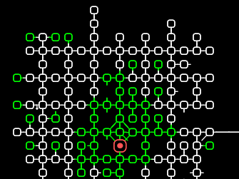

# TinTin++ Mud Client
This is a fork of [tintin++](https://tintin.sourceforge.io), a text based MUD client, which aims to improve the automap display by supporting more combinations of exits in mudfont mode.

A font is included that contains the necessary symbols (and only the necessary symbols), with a fontconfig file that allows the symbols to be used in addition to any terminal font.

## Installation
To create the main tintin++ executable:

    git clone git@gitlab.com:inutt/tintin.git
    cd tintin/src
    ./configure
    make

To install the font:

    mkdir -p ~/.fonts
    cp tintin/font/Flexible-Mud-Symbols.otf ~/.fonts/
    mkdir -p ~/.config/fontconfig
    cp tintin/font/fonts.conf ~/.config/fontconfig/
    fc-cache -r

After installing the font, you will need to restart your terminal emulator by closing all open terminal windows and opening a new one for it to recognise the new configuration.

## Licensing
  - Font:
    - The current position and room/exit direction symbols were created for this project by [Inutt](https://gitlab.org/inutt), and are licensed under the [Open Font Licence](https://scripts.sil.org/OFL_web).
    - The weather related icons are from the [Weather Icons](https://github.com/erikflowers/weather-icons) project, and are used under the same Open Font Licence.

  - TinTin code:
    - TinTin++ is licensed under the [GPLv2](http://www.gnu.org/licenses/gpl-2.0.html), as included in the source code downloads available from [the official TinTin++ webpage](https://tintin.sourceforge.io).
